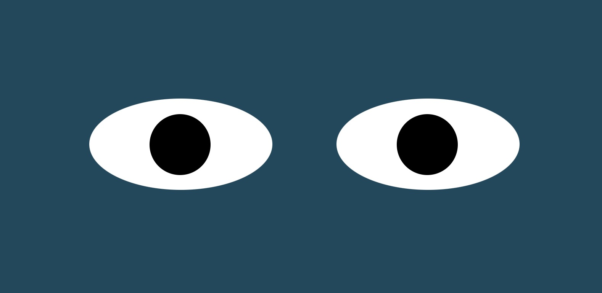

# Eye Exercise

## Description

A pair of eyes that track and follow your mouse around the screen with their gaze. This can be applied to tracking a text cursor.

## Installation 

Simply clone or download the project folder to your local machine and open the index.html file in your browser. 

## Future Improvements

Eventually the eyes will track the caret, or text cursor, as text is entered into a text input field.
